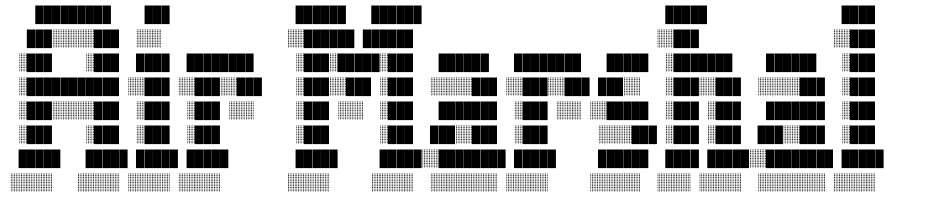
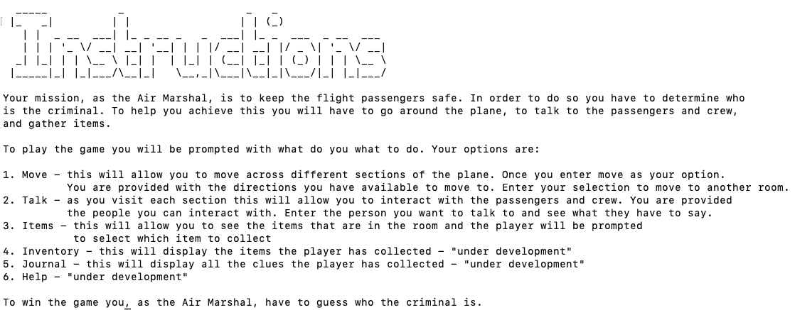
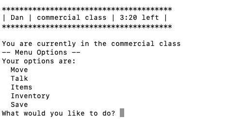
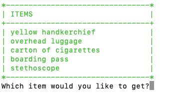
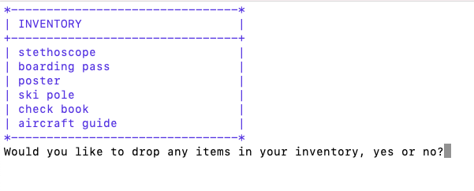

## Team: The Nimble Four
- Abdularazak Yusuf
- Quentin Young
- Danstan Kimuli
- Sheila Cartagena

## Project Description
- Interface: Text based Console Java Game (Non-GUI)
- Genre: Crime & Adventure

### How to Run the game
#### Project Location
Download the zip file, on the right side of your screen under Releases,
go to tags/Release-#/Assets/Air-Marshal_Deployment_#.zip

#### Run Commands
On the Command line / terminal, type:
- run.cmd - For Windows
- ./run.sh - For Mac

### Technology
Java
#### External Libraries
- JSON.simple
- Prompter
- Console
#### Special Features
- User is able to interact with objects in a room such as pick them up and drop them in another room
- User is able to save their progress & restore it later on
- Game comes with music playing in the background
- User is able to adjust music options such as pause, stop and play
- Game runs on a timer that is ticking down every second

### What it is about
You wake up and are dazzled realising that you are on a plane.
As you stare around you start looking in your pockets, in them, you find a badge that reads 'Air Marshal' and a phone.
Upon futher inspection, you find an unread message on your phone that is informing you about a murder that is supposed to take place, 
and it's upon you to gather clues, talk to the passengers and uncover who the 
criminal is. 

### General Game Flow
At the start of the game, a user can decide to right away play the game, or they can select
Game option 3 which is to view the instructions for details on how to play the game.

Once the user selects Game option 1, user starts in the commercial class, in order to perform an action, user is provided with a menu that 
display the basic actions as shown below:
  
User is able to enter any of the above keywords to interact with the game such as 
items which displays a list of the available items in the room
  
Once an item is picked up, it is added to your inventory and you can view it by typing "inventory"
  

### Optimization
In order to reduce on the amount of code complexity we decided as a time to load
data from JSON files into our game, this also saves us on the lines of code to write

